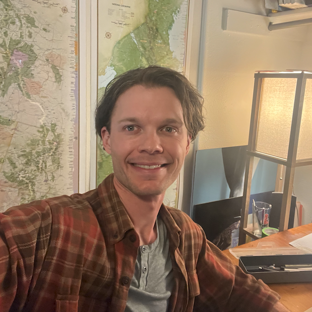

# About Me

Hi there! I'm Nick Hunkins, a data scientist with a Masters in Computer Science and a Bachelors in Mathematics. I have 3 years of industry experience working in the data science profession and 4 years of experience in applying these skills to conduct academic research. My work has primarily focused on AI for education and the relationship between social media and wellbeing. The current instantiation of social media is deeply concerning to me, specifically with respect to how it exploits human cognition to manipulate attention for private profit. In alignment with this concern, I currently work with the non-profit [Post-Internet Project](https://www.postinternetproject.org) as a data scientist. If you'd like to learn more, [here's my resume](https://drive.google.com/file/d/1cIncJAtieWxsv3reWe-Kk3UpfnWXtz1k/view?usp=drive_link). 

While I love using my knowledge of math, stats, and computer science to discover and explain insights in data, I have much more that I'm passionate about!

I love to spend time outside around Boulder, CO, my current home. Hiking, rock climbing, and scrambling are some of my favorite outdoor activities. Here's a pic of me scrambling one of the flatirons in Boulder's beautiful skyline. 

Though Boulder offers a lot of access to the outdoors, I love to get way out there into the backcountry. When summer rolls around you can find me out backpacking or alpine climbing somewhere in or around the great state of Colorado. Here's a shot of me with my two good friends Sam and Owen on the summit of Vestal Peak in the San Juans. 

In the summer of 2023 I spent five weeks walking the 500-mile Colorado Trail from Denver to Durango. It was one of the most memorable experiences of my life, and I hope to do more thru-hiking in the future. Here's me after finishing the trail at the southern terminus in Durango. Despite my smell, my lovely partner Maggie kindly came to celebrate with me (and give me a ride home). 

At home, I love to paint, read, and play the guitar. After completing the Colorado Trail I made the above painting to honor that time. It's inspired by scenes both real and imagined through my wanderings over the southern Rocky Mountains. 

Here are our pets, Aubrey the cat and Walnut the dog. They're a silly pair, but they get along well, and they bring us a lot of joy.

I've been fortunate to find Eon Zen, a warm and welcoming community with whom I've been practicing Zen Buddhism for the past few years. This is a group photo after a weekend retreat in the winter of 2022. 

For all of my interests, here's where I actually spend the majority of my time -- working at my desk. It's a good desk. It has a comfy chair and a window view over an open space. I like it best in the morning with a fresh cup of hot coffee on it. 

So that's a little bit about me. Please reach out if you'd like to have a conversation! I'm looking forward to hearing from you. 

