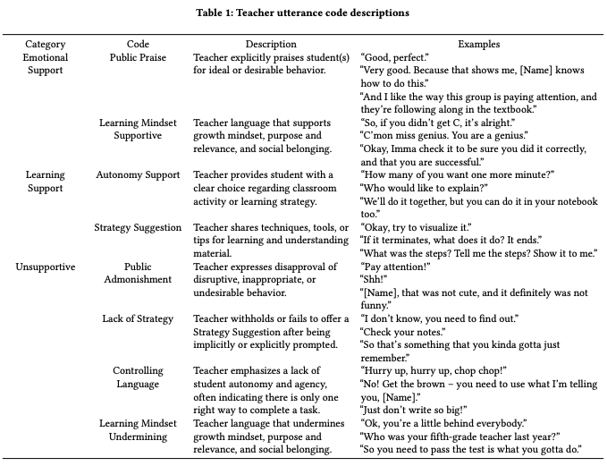
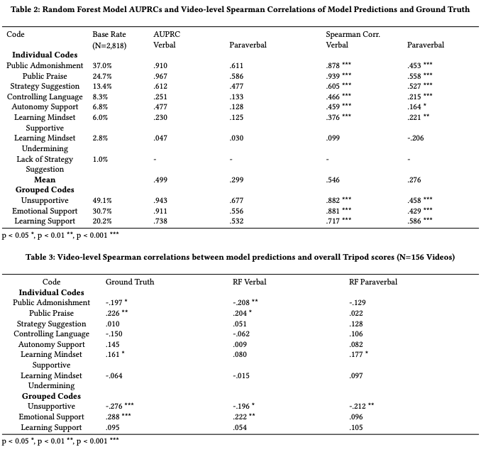
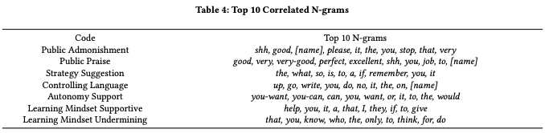

<head>
  <link rel="stylesheet" href="../assets/css/projectstyles.css">
</head>

# “Beautiful work, you're rock stars!”: Teacher Analytics to Uncover Discourse that Supports or Undermines Student Motivation, Identity, and Belonging in Classrooms

### NOTE: This research project resulted in publication at the 2022 Learning Analytics & Knowledge Conference 

- [ACM Digital Library Link](https://dl-acm-org.colorado.idm.oclc.org/doi/10.1145/3506860.3506896)
- <a href="../assets/img/projects/cetd-belonging/beautiful-work-youre-rockstars.pdf" target="_blank">Full Text PDF Link</a>

#### Project Summary

From carefully crafted messages to flippant remarks, warm expressions to unfriendly grunts, teachers’ behaviors set the tone, expecta- tions, and attitudes of the classroom. Thus, it is prudent to identify the ways in which teachers foster motivation, positive identity, and a strong sense of belonging through inclusive messaging and other interactions. In this project, collaborators and I leveraged a new coding of teacher supportive discourse in 156 video clips from 73 6th to 8th grade math teachers from the archival Measures of Effective Teaching (MET) project. We trained Random Forest classifiers using verbal (words used) and paraverbal (acoustic-prosodic cues, e.g., speech rate) features to detect seven features of teacher discourse (e.g., public admonishment, autonomy supportive messages) from transcripts and audio, respectively. While both modalities performed over chance guessing, the specific language content was more predictive than paraverbal cues (mean correlation = .546 vs. .276); combining the two yielded no improvement. We examined the most predictive cues in order to gain a deeper understanding of the underlying messages in teacher talk. We discuss implications of our work for teacher analytics tools that aim to provide educators and researchers with insight into supportive discourse.

##### Data: 

In this project we analyzed 156 classroom videos of 73 6th-8th grade math teachers from the archival Measures of Effective Teaching (MET) project. Each video was transcribed and annotated using a high-quality video coding protocol related to aspects of teacher discourse. See Table 1 for a complete description of codes.

##### Research Questions

<b>RQ1.</b> What are the relative contributions of the verbal and paraverbal modalities of teacher speech with respect to teacher messages within the support domain?

<b>RQ2.</b> How do verbal and paraverbal models of teacher support correlate with student perceptions of the classroom environment

<b>RQ3.</b> What specific patterns of language are most relevant for predicting each dimension of support-related teacher messages?

##### Findings

<b>RQ1.</b> 
We found that verbal cues outperformed paraverbal cues for all discourse features and their combinations. This is unsurprising for codes such as Public Admonishment and Praise, as both codes are evidenced by the presence or absence of particular words (e.g., “shh”, “good”). However, the paraverbal models out-performed chance guessing for all codes except Learning Mindset Undermining, which was also poorly predicted based on verbal cues. This shows that the paraverbal modality of teacher speech conveys a detectable signal indicative of teacher support-related messaging. Despite the predictive power of both modalities of teacher speech, combining them yielded no improvement in model performance. It should be emphasized that our analysis was performed using manually segmented and transcribed teacher utterances. Thus, while the paraverbal modality added no value to the high-quality verbal information in this study, results might change for analysis with automatic speech recognition (ASR)-based transcripts, which are prone to erroneous transcriptions.

<b>RQ2.</b>
Three of the eight (human-coded) individual discourse codes (Public Admonishment, Public Praise, and Learning Mindset Supportive) correlated with the overall Tripod score, a pattern replicated by two of the verbal models (Public Admonishment and Praise) and one paraverbal model (Learning Mindset Supportive). Although determining whether students themselves agree with our coding scheme is an important area of future work, the correlation between these three codes and the overall Tripod score indicates some degree of alignment We also found that both models’ predictions of Unsupportive grouped codes correlated with Tripod scores, suggesting that student perceptions are particularly sensitive to unsupportive messaging for both verbal and paraverbal cues. This finding indicates that it is possible to train models to predict student perceptions of classroom environment from MFCCs extracted from audio recordings without the need for long-term storage of classroom audio or transcriptions, a relevant finding for protecting the privacy of students and teachers alike.

<b>RQ3.</b> The top 10 important n-grams identified by the Random Forest verbal models helped identify relevant examples of teacher utterances for each code (e.g., the word “give” for Learning Supportive Mindset in the utterance “[Name], let’s give everyone a chance”). This analysis can be used to ground codes in salient example utterances, which can then be used to present relevant examples for teachers to reflect upon. Additionally, providing teachers with certain words and phrases that commonly occur with a given discourse feature can help them appropriately adjust the language they use in their lessons.

