<head>
  <link rel="stylesheet" href="../assets/css/projectstyles.css">
</head>

# Neurokit2 Processing Tools:  Electrodermal Activity (EDA)

#### 1. Introduction
Electrodermal activity (EDA) has many names (galvanic skin response (GSR), electrodermal response (EDR), psychogalvanic reflex (PGR)) and has been studied ever since its discovery in the mid 1800’s. The EDA signal itself is simply a measure of the skin’s electrical conductance over time. When an increase in sweating occurs, it produces a higher concentration of water (in addition to other substances like lactic acid and urea) which then augments the electrical conductance of the skin. As more sweat is present between the skin and affixed electrodes, less resistance – or more conductivity – is recorded. These changes in sweat gland activity can result from both thermoregulatory processes and sympathetic reactions to stimuli. If electrodes are placed on the skin – specifically on the plantar and palmar sides of the hand, regions known to be more associated with performance than temperature control – then the resulting EDA signal can be interpreted as a functional measure of sudomotor activity, and consequently, an objective measure of arousal. 

#### 2. The EDA Signal
The EDA signal itself is measured in microsiemens (µS) ranging from 0.5-45 µS and is characterized by slow rolling changes in amplitude with sharper changes associated with specific responses. We typically want to decompose the EDA signal into two parts: the tonic component, which consists of the slow, smooth changes over time, and the phasic component, which consists of sharper, stimuli-specific responses. The most salient features of the phasic component of an EDA signal are the skin conductance responses (SCRs) and are caused by underlying sympathetic reactions to stimuli. SCRs appear in the signal as peaks with sharp increases and steady decreases over time (fig 1.). 

We can use SCRs to evaluate a subject’s response to event-related or tonic stimuli. When caused by a stimulus, the onset of an SCR is usually between 1 and 5 seconds after delivery. The time from the onset to the peak – termed the rise time – varies between 0.5 and 5 seconds. The time it takes from the peak to the end of an SCR– known as the recovery time – is the longest phase of an SCR and need not complete before another SCR starts, a fact that complicates EDA analysis.

<figure>
  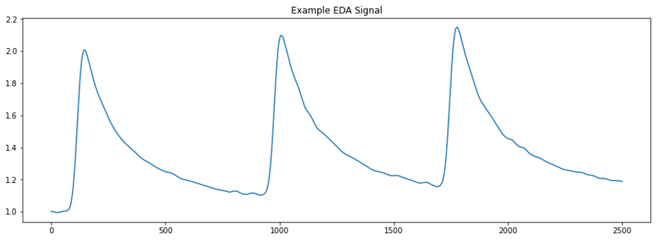
  <figcaption color="red"><b>Fig.1</b> EDA signal with 3 SCRs.</figcaption>
</figure>

The benefits of EDA data are clear. We can use the signal to evaluate the arousal of experimental subjects in response to stimuli presented in experimental settings. An index of arousal alongside other streams of data (i.e. EEG, speech transcripts, eye gaze features, mind wandering predictions, etc.) promises new areas of exploration and analysis for several studies within the Emotive Computing lab. So, what exactly is stopping us from processing all this EDA data and getting started? 

#### 3. EDA Signal Quality

Like most other methods for recording biological signals, collecting EDA data is subject to a variety of noise. The two most common sources of noise are high-frequency noise and motion artifacts. 

High-frequency noise is introduced when the recording device picks up activity from other nearby electrical instruments (i.e. computers, lab equipment, lights, etc.). When plotted, this noise appears as low-amplitude, high frequency wiggling in the signal.  Motion artifacts are introduced when a participant moves their body in a way that interferes with the EDA recording device, which appears as a large and rapid change in the EDA signal. 

In addition to these sources of noise, there is the added challenge of separating the signal into its tonic and phasic components. As mentioned earlier, one SCR need not complete before a second one starts, meaning that many SCRs can overlap in the signal. This issue of separation has led to a variety of approaches and algorithms to separate the two components. Details about the methods to separate the tonic and phasic components is beyond the scope of this current effort but note that there is no standard approach to this problem and a variety of algorithms exist. For this project, we will primarily focus on cleaning the originally recorded EDA signal prior to its separation into its phasic and tonic components. 

#### 4. Raw EDA Sample Data

Below is a plot displaying the EDA data collected from four subjects who participated in a study of collaborative problem solving. The quality of the signal was ranked by people who have been trained to assess the quality of EDA signals. The rank for each signal is either A, B, C, or F, where A is of the highest quality and F is of the lowest. We can see from the plot that the F quality signal is not usable and is thus not considered moving forward. The device used to collect EDA data samples at a frequency of 51.2Hz and is used in 15-minute studies, resulting in 46,080 data points per signal. 

<figure>
  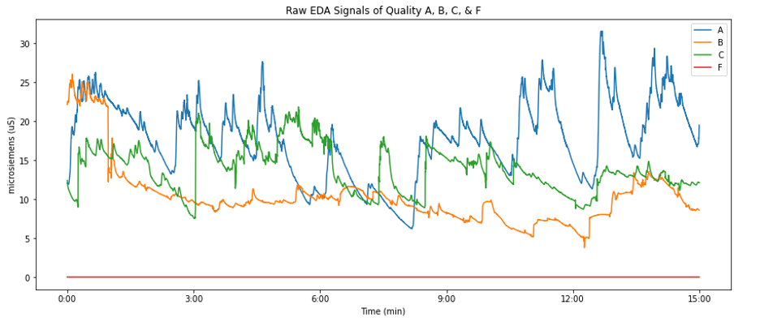
  <figcaption color="red"><b>Fig.2</b> EDA signals with quality ratings of A,B,C,& F.</figcaption>
</figure>

In addition to the raw EDA data collected from real participants, included is a synthetic signal with a sampling rate of 51.2Hz for 1000 data points composed of sin waves to use for testing purposes. The equation used to generate this signal is:

> $$f(x) = 5 + sin(4\pi x) + 0.5 sin(2\pi x) + 2 sin(0.6\pi x)$$

<figure>
  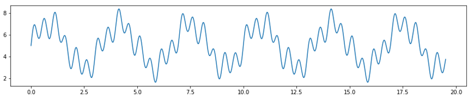
  <figcaption color="red"><b>Fig.3</b> Synthetic Signal</figcaption>
</figure>

#### 5. Investigating EDA Signal Cleaning in Neurokit2

[Neurokit2](github.com/neuropsychology/NeuroKit) is an open-source Python toolbox for neurophysiological signal processing. It has functionality to handle a variety of bodily signals including ECG, PPG, EDA, EMG, and RSP. For our purposes, we focus on its EDA functionality. 

The traditional approach for automatically handling noise and motion artifacts in EDA data is to first smooth the signal with a low-pass filter and then identify and remove corrupted signal segments. The frequency threshold for the low-pass filter can be as low as 1-5Hz to remove the unwanted high-frequency noise introduced by extraneous electrical equipment. 

##### 5.1 Signal Cleaning on A-Quality Data

Neurokit2 performs this cleaning step with a single function called eda_clean, which takes in the raw EDA signal, the sampling rate, and our choice of either the neurokit or BioSPPy methods. The neurokit method low-pass filters the raw signal using the Butterworth method. The BioSPPy method similarly applies a low-pass filter but then smooths the signal using a convolution with a boxzen kernel. Let’s plot a chunk of the A quality EDA signal before and after cleaning using these two methods. 

<figure>
  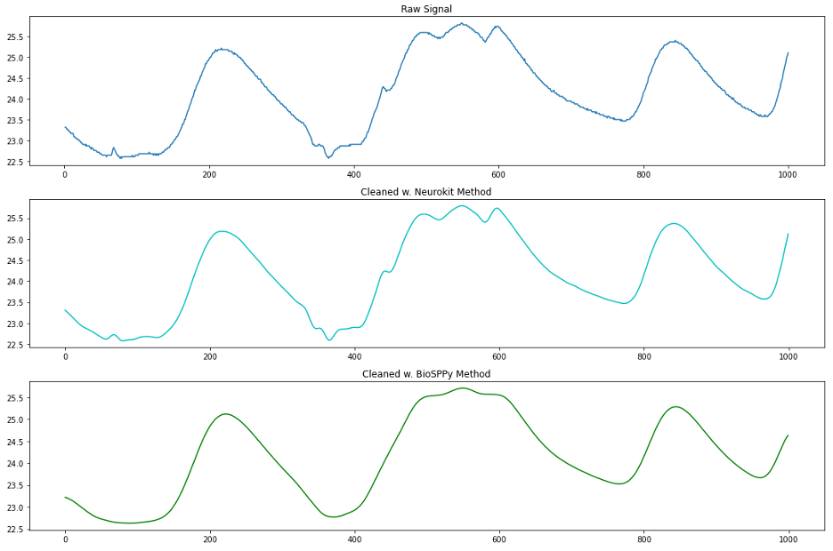
  <figcaption color="red"><b>Fig.4</b> Comparison of Neurokit vs BioSPPy signal cleansing techniques</figcaption>
</figure>

At first glance, we see that the BioSPPy method removed the high frequency noise and smoothed our signal substantially. Particularly in the middle ridge of data we notice that the faster oscillations (higher frequency) in the signal were smoothed almost completely. By comparison, it does not look like much happened to the signal between the raw signal and neurokit-cleansed signal, but when we zoom in and plot only 100 sample points, we see that the neurokit method did indeed remove high frequency noise as well as perform smoothing.  

<figure>
  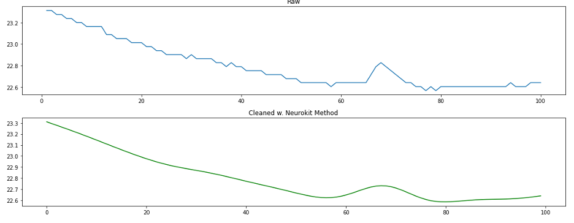
  <figcaption color="red"><b>Fig.5</b> Close up of Neurokit signal cleansing technique</figcaption>
</figure>

##### 5.2 Signal Cleaning on Synthetic Data

To get a better insight into what’s going on here, we repeat the investigation of these two methods on our synthetic signal. 

<figure>
  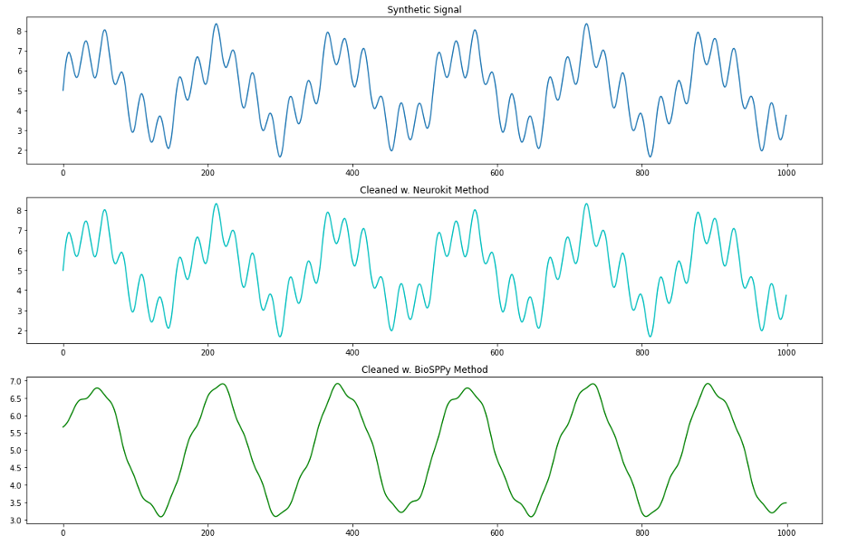
  <figcaption color="red"><b>Fig.6</b> Signal cleansing techniques on synthetic data</figcaption>
</figure>

We see from this plot that the BioSPPy method removes a lot of information about the higher frequency oscillations in our signal. Let’s use the DFT to see what kind of information is being removed between our raw synthetic signal and the BioSPPy-cleaned signal. 

<figure>
  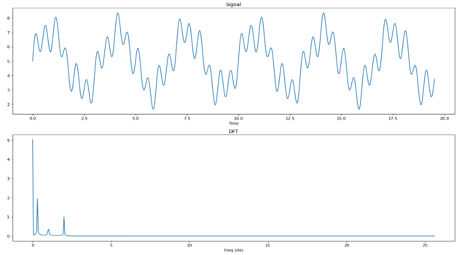
  <figcaption color="red"><b>Fig.7</b> Synthetic signal & DFT output of magnitude in frequency domain</figcaption>
</figure>

<figure>
  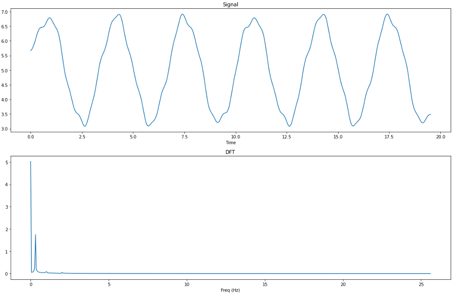
  <figcaption color="red"><b>Fig.8</b> BioSPPY-cleaned synthetic signal & DFT output of magnitude in frequency domain</figcaption>
</figure>

By comparing the output of the DFT on the synthetic signal both before and after cleaning using the BioSPPy method, we can see that the frequencies at 1Hz and 2Hz have been almost entirely filtered out of the signal, whereas the 0.3Hz frequency survived. From this we can determine that the BioSPPy cleaning method employs a lower low-pass filter than the neurokit method and is perhaps better suited to clean data with a high amount of noise (i.e. EDA data collected off of a wearable devices ‘in the wild’ that are subject to unpreventable motion artifacts throughout the day). 

##### 5.3 Signal Cleaning on C-Quality Data With a Motion Artifact

We now compare the two methods on a chunk of C quality EDA data that includes a motion artifact. 

<figure>
  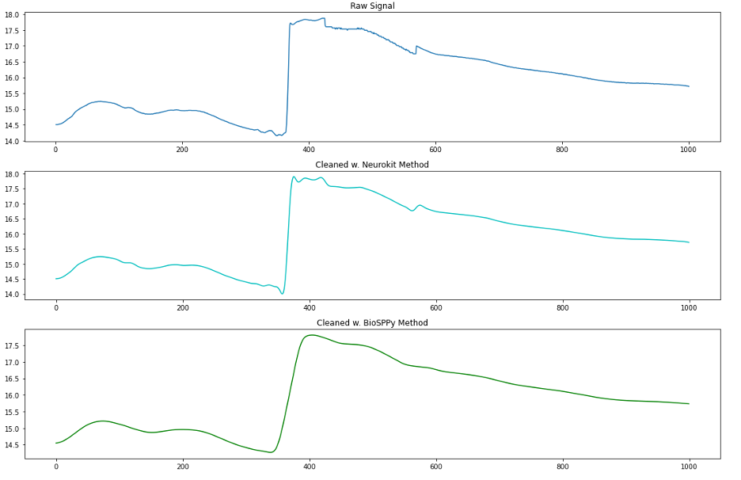
  <figcaption color="red"><b>Fig.9</b> Comparing cleansing techniques on motion artifact data</figcaption>
</figure>

We can see from this plot that a motion artifact is present in the raw data around the 380th sample. Neither method handles this well, and in fact the BioSPPy method has changed the shape so much that it could be mistakenly interpreted as an SCR. So it seems we found that while Neurokit2’s eda_clean() function handles the high frequency filtering and smoothing steps of EDA preprocessing quite well, it does not automatically address large motion artifacts such as this. 

##### 5.4 Detecting Motion Artifacts

Is it possible to detect motion artifacts in EDA data in an automated way? By using a similar method to the one described in [3], we can convolve our EDA signal with the first derivative kernel [-1,1] and take the absolute value at every point of the resulting convolution to find the rate of change in EDA between each sample. After performing this convolution, we can then locate and flag motion artifacts in the data simply by finding where the rates of change of EDA in our signal are impossible (or extremely unlikely). Below is a plot of our C quality signal and its resulting convolution with the first derivative kernel. 

<figure>
  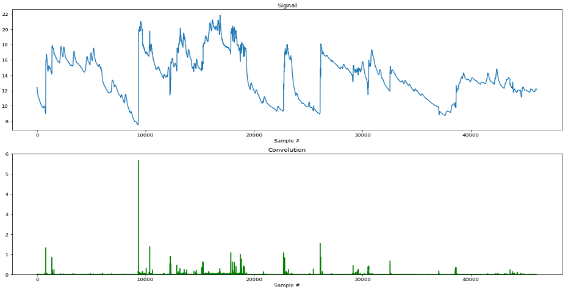
  <figcaption color="red"><b>Fig.10</b> C-quality signal convolved with first derivative kernel</figcaption>
</figure>

We can see from the plot that our method does a pretty good job! Most noticeable is the huge motion artifact occurring around the 9000th sample point (~3 min into the experiment), which was detected and proportionally represented in our convoluted signal. As a sanity check, let’s perform this same technique on our A quality signal. Since the quality of the signal is known to be much higher, then we would expect fewer motion artifacts to be present, and consequently, lower magnitudes of change detected in the convolution. As we can see in the following plot, our prediction was correct! 

<figure>
  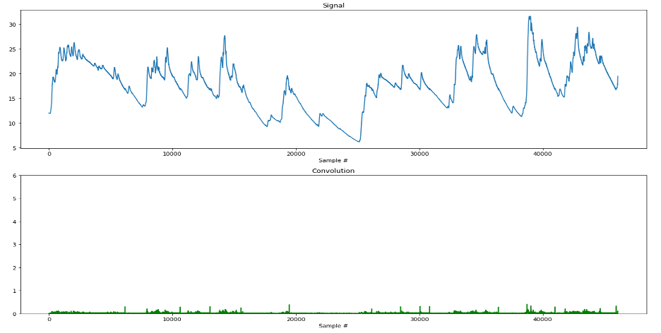
  <figcaption color="red"><b>Fig.11</b> A-quality signal convolved with first derivative kernel</figcaption>
</figure>

### <a href="https://github.com/nchp89/dsp-fp-sp21/tree/main"><u>Check out the github repo for this project here!</u></a>

#### Conclusion

The goal of our investigation into cleaning EDA data using Neurokit2 has been to learn whether the automatic EDA processing functionality provided by Neurokit2 was sufficiently aligned with standard practices as described in the literature. 

The standard practices to clean noisy EDA data are to low-pass filter the EDA signal, smooth it, and then detect and repair motion artifacts [1]. We found that the standard EDA cleaning methods in Neurokit2 (neurokit and BioSPPy) both clean and smooth the EDA data in a way that is aligned with existing literature. While both processes perform low-pass filters and smoothing operations, the BioSPPy method’s filter is lower than the neurokit method and removes frequencies even below 1Hz. 

We also found that neither method automatically handles motion artifacts. We then chose to implement a method like the one discussed in [3], where the EDA signal is convolved with the first derivative kernel [-1, 1] to find rates of change in the signal. The absolute value of each point in the resulting convolution was then taken to determine the magnitude of the change in signal. We saw that this technique shows promise in the automatic detection of motion artifacts in EDA data.

### References 

[1]	Posada-Quintero, H. F., & Chon, K. H. (2020). Innovations in electrodermal activity data collection and signal processing: A systematic review. Sensors (Switzerland), 20(2). https://doi.org/10.3390/s20020479

[2]	Makowski, D., Pham, T., Lau, Z. J., Brammer, J. C., Lespinasse, F., Pham, H., Schölzel, C., & Chen, S. H. A. (2021). NeuroKit2: A Python toolbox for neurophysiological signal processing. Behavior Research Methods. https://doi.org/10.3758/s13428-020-01516-y

[3]	Subramanian, S., Barbieri, R., & Brown, E. N. (2019). A Systematic Method for Preprocessing and Analyzing Electrodermal Activity. 2019 41st Annual International Conference of the IEEE Engineering in Medicine and Biology Society (EMBC), 6902–6905. https://doi.org/10.1109/EMBC.2019.8857757
