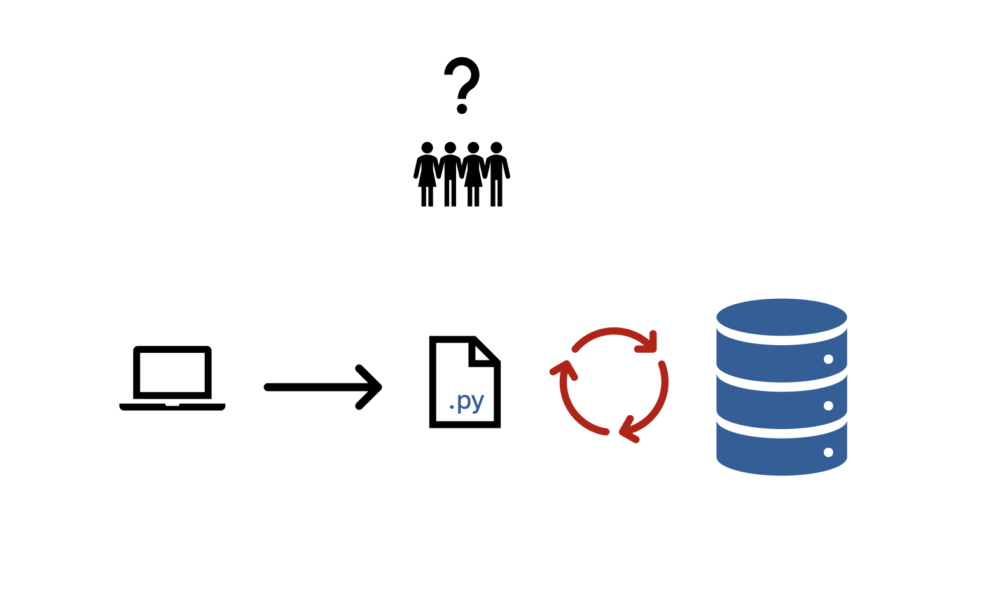
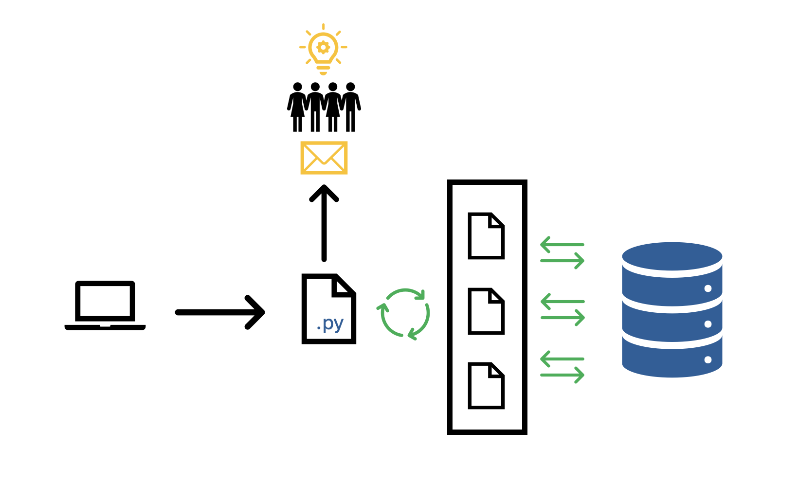

<head>
  <link rel="stylesheet" href="../assets/css/projectstyles.css">
</head>

# Optimizing Hadoop Ingests

## The Need For Data
In my professional experience working as a Sr Advanced Analytics Developer at Graybar Electric, I worked in a variety of roles. Sometimes I would focus on software development and my days were spent writing Python and SQL. At other times I would concentrate on developing data visualization tools in Qlik for the consumption of business users external to our team. 

Regardless of the task I was working on, one thing was always the same: the need for up-to-date, reliable data.

Our team leveraged an on-prem Hadoop cluster to store and analyze the vast quantities of data produced by the day-to-day business. After about a year of working on the team, I began transitioning into a data engineering role and learned more about Hadoop and the braoder concept of distributed computing. 

##### The Shift to Data Engineering
What prompted my shift into a data engineering role was the emergence of a new and serious problem: the process to update the team data lake each day was severely outdated and was no longer trustworthy.  

The troubled process was written at a time when the team required just 24 data tables to conduct all of their work. By this time in the teams lifespan, we needed over 150 tables to be up-to-date each morning we came into work, and that number was only growing. It was time for an upgrade.

## The Problem

The old data ingestion process had three major issues: speed, visibility, and reliability. A new process would have to address and improve each of these three parts.

##### Speed
From start to finish, it took about 22 hours for the old process to perform a complete update on all of our data tables. If the team was expected to work 8 hours a day, they should expect to have reliable data for at least that duration. The most they could hope for at this juncture was for 2 hours of stable data. It goes without saying that this status quo was beyond unacceptable.

##### Visibility
When a data table ingestion failed, it failed silently. The only way to learn of a failed update was to either look into the endless log files or to stumble upon an error while browsing data that one thought was up-to-date. Of course, outdated data can be hard to detect for end users, especially when relying on downstream data that has already been manipulated in some way, and even more so when there is an <i>expection</i> that the data has been updated. 

##### Reliability
Finally, when a table ingest did fail (something that happened all too often), there was no automated process to handle that failure. It just failed and moved on to the next table as if nothing had happened. That meant that any tables that failed during a given ingest had to be manually updated if they were to be used that day. This produced a lot of unnecessary extra work for the team, and it distracted us all from more important and valuable work.

<figure>
  
  <figcaption color="red"><b>Fig.1 - Old Process Pipeline Diagram:</b> The process sequentially ingests each table which causes a bottleneck of performance, all the while providing no visibility to team members.</figcaption>
</figure>

## The Solution

A teammate and I sat down together one day and began combing through the code that made up the old process. After a few days of brainstorming and testing ideas, we came up with a solution. It would be a completely new process built on five ideas: 

<ol>
    <li>Parallel Processing</li>
    <li>Deltas</li>
    <li>Priority Queue</li>
    <li>Email Notifications</li>
    <li>Automatic Retries</li>
</ol>

##### 1. Parallel Processing

As mentioned above, the most important issue to fix was speed. The old process relied on a sequential ingestion procedure in which each table would be ingested one-at-a-time. This implementation failed to leverage the enormous amount of processing power at our disposal with our Hadoop cluster. 

For this, we turned to multiprocessing. Rather than performing one table ingest at a time, we would perform many table updates concurrently. To do this, we wrote a controller script that would check the load on our cluster, and then if sufficient resources were available ("sufficient" being determined by time of day and day of week) then a new task was started and kicked off. This single change vastly improved the speed of the process from start to finish.

##### 2. Deltas

Despite the benefits gained from parallelizing the ingest process, there was still a challenge of updating very large tables. There were certain tables related to sales items and orders that held hundreds of millions of records. Further, it didn't make sense to update the tables in their entirety, as a vast majority of the data did not change from day-to-day. 

For this problem, we used something called a delta process. In SAP databases, there are certain tables to track changes in other tables. We used this feature to identify only the new and updated records for a subset tables in SAP, and then only ingested those records into Hadoop. This process change greatly reduced the total time needed to update the largest tables in our database.

##### 3. Priority Queue

Another feature added onto the pipeline was a priority queue. Tables that were considered the highest priority would be updated before those considered low priority. Priority was decided based on analyzing which tables in Hive were most frequently accessed as well as asking teammates which tables were most important to be up-to-date for their current work. 

While this feature did not reduce overall process time, it guaranteed that those tables that were needed most were updated first. 

##### 4. Email Notifications

In the past when ingests had failed, they failed silently. Teammates would conduct their work in total ignorance of ingest failures that could be affecting their analyses. Additionally, it wasn't clear when a table had been updated, and a common occurence on the team would be somebody working on a problem in the morning only to discover in the afternoon that the data wasn't up-to-date until 2pm. 

We added a feature to the process where email notifications were sent out to alert teammates to ingest status. When an ingest failed, data engineers were automatically notified via email so they could fix the issue ASAP. Teammates could provide a list of tables they wanted to track for which they would receive emails when a table on that list was updated or had failed to update. 

Email notifications helped the data engineers stay on top of ingest failures and provided teammates with much needed visibility on the quality of their data resources. For this reason, it was the most popular new feature amongst teammates!

##### 5. Automatic Retries

The final feature added into the updated process was an automatic retry process for table ingestion. In the past, when a table ingestion failed, it failed silenty and then the next table was tried. With automatic retries, if a table ingestion failed the process would retry the ingest up to 5 times with increasing amounts of waiting time between attempts. That is, if the first attempt failed, it would wait 1 second before trying again. If the second attempt failed, it would wait 30 seconds before trying again, and so on until 5 attempts had been made. After 5 failed attempts, the table ingestion would be considered a failure, and the process would proceed to the next table.

Automatic retries drastically reduced the number of failed ingests per day. With the old process, it was common for up to 20 table ingestions to fail per week. With automatic retry, that number was reduced to near 0. 

<figure>
  
  <figcaption color="red"><b>Fig.2 - Updated Process Pipeline Diagram:</b> The process is managed by a controller that dynamically performs ingests in parallel based on a priority queue. When ingests fail, they are retried. Email notifications are sent to team members for important updates or for ingest failures.</figcaption>
</figure>

## Results

When all was said and done, the updated process reduced total update time from 22 hours to about 7 hours, less than $$\frac{1}{3}$$ the duration of the old process. This meant that table updates could be done completely overnight! When the team came into work in the morning they could check their email and be confident that they were working with up-to-date data. 

