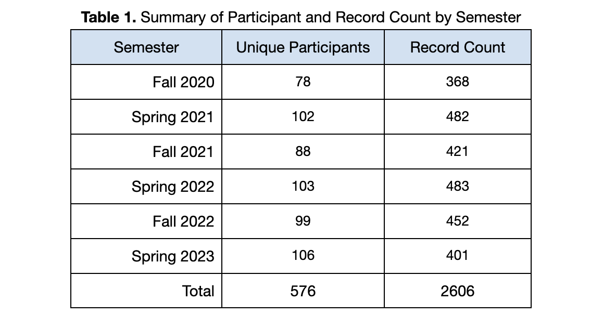
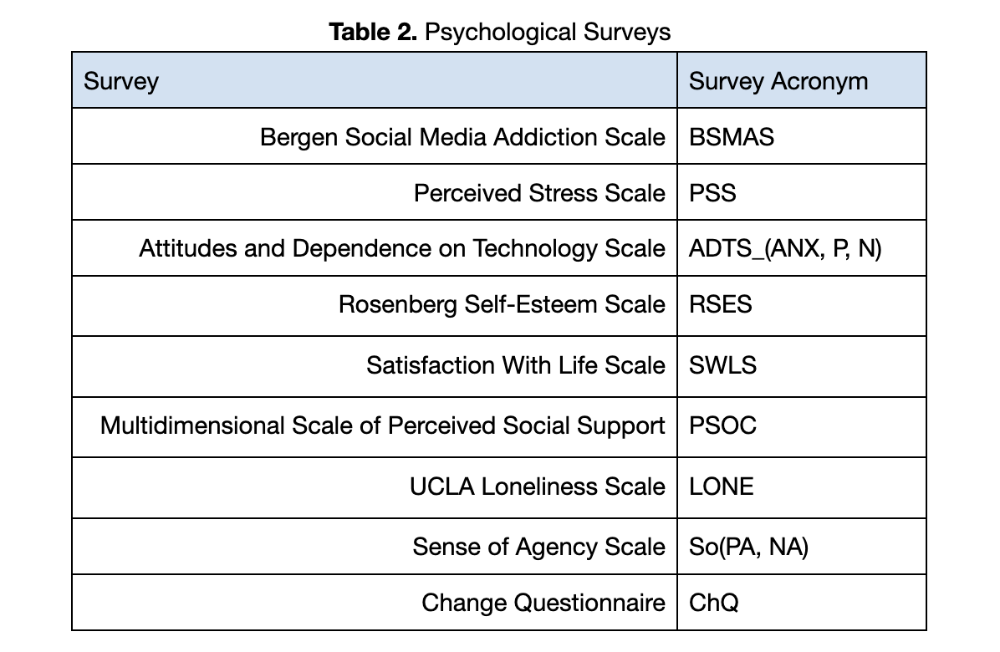
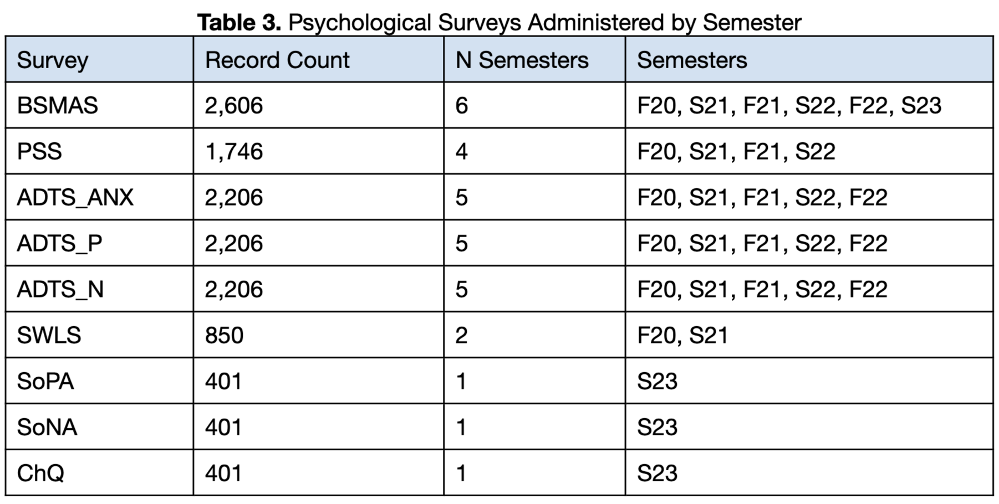
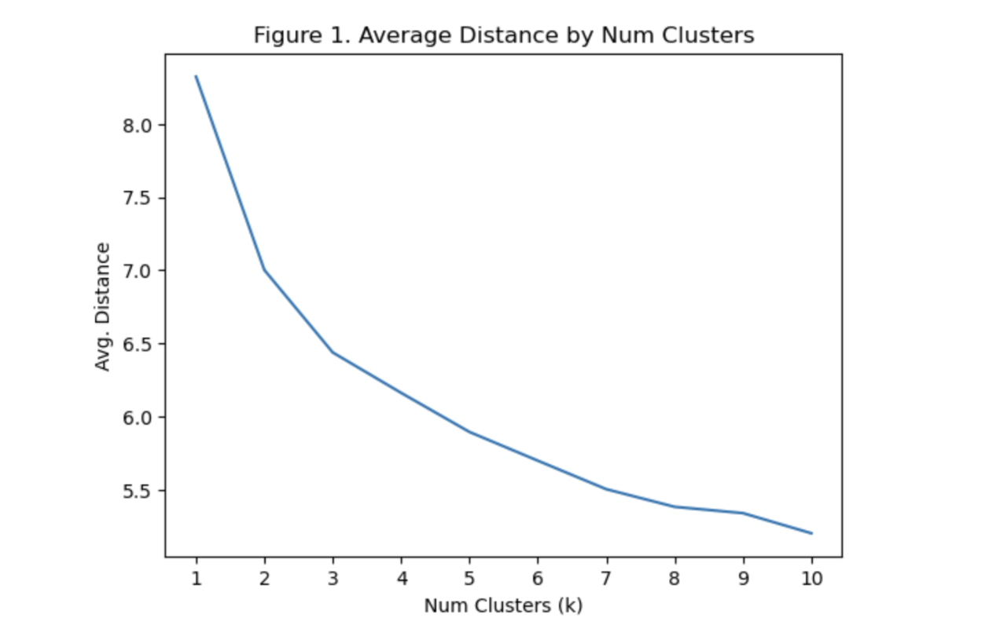

<head>
  <link rel="stylesheet" href="../assets/css/projectstyles.css">
</head>

# PRISM

## Introduction
<b>P</b>ersonalized <b>R</b>elationship <b>I</b>mprovement with <b>S</b>ocial <b>M</b>edia, or PRISM, started as a research project with ATLAS faculty member Dr. Annie Margaret at the University of Colorado - Boulder. This project contributed to the founding of the non-profit organization [Post-Internet Project](https://postinternetproject.org) and is now in development for full integration into the platform. Beta testing starts in May 2024. In my ongoing work with the Post-Internet Project I own and manage the PRISM project. In this role I manage a small team of developers, develop the PRISM website via web development and content production, and provide data analysis and modeling for product development and enhancement.

<video width="100%" autoplay muted>
    <source src="../assets/img/projects/prism/PRISM logo animation.mp4" type="video/mp4">
</video>

## What is it?
PRISM is an educational experience intended to help young people who show signs of social media addiction. PRISM focuses on education, agency, and self-directed change to improve personal relationships with social technologies (e.g., smartphones, social media, etc.). It is based on scientific research and has been proven to be an effective intervention for reducing addiction levels of social media use. Much of the work that led to the instantiation of PRISM has roots in my prior work which can be found in the [SMC Analysis](./smc-analysis) and [SMC Annotations](smc-annotations) projects on the Home page.



## How does it work?
With PRISM, participants undertake a social media challenge, where they spend time reflecting on their current relationship with social media and set their own goals for changes they would like to make. Over the course of four weeks, participants i) self-report their success in adhering to their goals, ii) reflect on their feelings and experiences, and iii) complete surveys related to social media addiction and other mental health outcomes, all while learning about the complexities of modern technology, human psychology, and healthy behaviors.

### Key research questions that informed PRISM development:
1. How do specific social media behaviors relate to outcomes of wellbeing?
2. What strategies are most and least effective at engendering improvement with social media?
3. What patterns do we see among participants that may shed light onto specific strategies of change that would be most effective, and can we predict what those strategies would be for new participants?

 

<h2 style="text-align: center;">Methods</h2>
 
<h4 style="text-align: center;">1. Data</h4>

##### 1.1 Summary

The dataset used in the development of PRISM consists of 576 college-aged participants across six semesters starting in Fall 2020 and ending in Spring 2023. The resulting dataset includes a total of 2606 total data points for analysis. See <i>Table 1.</i>

##### 1.2 Initial Survey

At the start of the challenge participants completed an initial survey that included demographic information (e.g., gender, age, etc.), open-ended questions about their social media behavior, open-ended questions about their goals for changing their social media habits, and a series of psychologically-validated surveys that captured constructs related to wellbeing. While demographic data was used elsewhere for initial analysis, none was used in the development of the automated features of PRISM.

##### 1.3 Weekly Surveys

Following the initial survey, participants completed weekly surveys to repeatedly capture the aforementioned constructs of wellbeing. Additionally, they self-reported their success in adhering to their goals during the previous week on a scale of 1 (did not adhere to goals at all) to 5 (adhered to goals very well) and then completed a free-response self-reflection on how the previous week went. See <i>Table 2</i> for a description of each survey administered.

##### 1.4 Selecting Surveys of Interest

The Bergen Social Media Addiction Scale (BSMAS) was used as the primary measure of social media addiction throughout all six semesters. The remaining surveys were used for a subset of the six semesters, as some were deemed less relevant to research efforts and replaced with different surveys. In the end, not all survey data collected correlated to the outcome variable of interest, the addiction score obtained through the BSMAS. For this reason, several surveys were discarded from further consideration for the remainder of the analysis.  See <i>Table 3</i> for a detailed breakdown of which surveys were included in the development of PRISM and which semesters they were administered.

##### 1.5 Imputing Missing Data Using Multiple Linear Regression

**1.5.1 Overview**

Due to missing data for each survey throughout the data collection process, multiple linear regression (MLR) was used to impute missing values for those participants who did not complete a given survey. This step was necessary for subsequent cluster analysis.

**1.5.2 Selecting Features**

Input features for the MLR model were chosen as follows. An initial subset of available features within the dataset were included for consideration if those features had a suitably large correlation (⍴≥0.1)  with the target variable. A permutation of the subset of features was then computed and iterated over, resulting in MLR models trained on all possible combinations of the subset of features.

**1.5.3 Model Validation**

We used 5-fold cross-validation to evaluate model performance using the Root Mean Squared Error (RMSE) as our loss function. Once a final subset of input features were chosen for each MLR model the models were trained using all available data and then used to predict the missing values for the remainder of the dataset.

**1.5.4 Limitations**

We note here that those surveys with the smallest amount of data (i.e., SoPA, SoNA, ChQ) will likely have worse predictions than the other features. To that end, further data collection is needed in future work. However, for our current purposes we believe that our data is reliable enough for further analysis.

<h4 style="text-align: center;">2. Clustering</h4>

##### 2.1 Summary

During the investigation of our data we observed several patterns where participants would often encounter similar challenges, and many of these participants were similar to each other. To further investigate this, we decided to perform cluster analysis. Cluster analysis is the process of taking a dataset and algorithmically grouping data points that are similar to each other into groups. In our case, we would group participants who had similar initial survey scores and social media behaviors together and see if their outcomes differed in some predictable way.

##### 2.2 Data Preparation

We started the data preparation process by removing all participants who did not have an initial BSMAS score of 19 or higher – the cutoff for problematic social media use. This would narrow our focus to those participants who we are primarily concerned with, those with higher than desirable social media addiction levels. This step filtered our dataset down to N=592.

We further removed all data that was not from the initial survey, as we want to group participants based on how they started the challenge and then observe how they performed for the remainder. After these two steps, we had a total of N=172 for clustering.

##### 2.3 K-means Clustering

**2.3.1 Overview**

We used the K-means clustering algorithm for our analysis, as it is lightweight and easily interpretable. K-means clustering works as follows: a predefined number of clusters k is given to the algorithm which are then randomly initialized in the data space. The algorithm then assigns each data point to its nearest cluster. The center of the cluster is then updated based on the data points that now belong to it, and the process is repeated until each of the clusters stabilize.

**2.3.2 Normalization**

Since cluster assignment is based on distance, it’s of the utmost importance that data be normalized. Otherwise the different scales across features will confuse the algorithm and the output will be nonsense. Consequently, our input data was normalized.

**2.3.3 Selecting <i>k</i> value**

We iterated over all possible cluster numbers from 1 to 10 and used the mean distance from a centroid to determine the best choice of <i>k</i>. Note that mean distance decreases as the number of clusters <i>k</i> increases. Choosing too high of a <i>k</i> values leads to overfitting the clusters to our data, and as a consequence they will not generalize well to unseen data. The best option is typically to choose the value <i>k</i> that corresponds to the largest amount of information gain with the least amount of additional parameters. This typically appears as an ‘elbow’ shape in the mean distance plot. In our case, we selected <i>k</i> to be 3 (<i>Figure 1</i>).  

##### 2.4 Cluster Analysis

**2.4.1 Overview**

Following the clustering step, each participant in the subset of 172 participants were assigned to one of the three clusters. Participants were then assigned to a category of success: high, moderate, and low. Success categories were based on the difference between the BMSAS score from the initial survey and the final survey – the absolute change in BSMAS scores across the challenge. Analysis was then performed at two levels: overall patterns and cluster-specific patterns.

**2.4.2 Success Categorization**

Within each cluster, participants with absolute decreases in the BSMAS score in the top quartile (75th-100th percentile) were assigned the label of high success, those in the middle two quartiles (25th-75th percentile) were assigned the label of moderate success, and those in the bottom quartile (0-25th percentile) were assigned the label of low success. Subsequent analysis was conducted by comparing the high success and low success groups.