<head>
  <link rel="stylesheet" href="../assets/css/projectstyles.css">
</head>

# Social Media Challenge:  Data Analysis

#### Introduction

In this analysis, we take first steps towards insight into how social media behaviors differentially relate to outcomes of well-being by analyzing a novel data set collected from 576 college students who participated in a four-week, self-directed social media challenge. It contains free response data about social media behaviors, self-directed goals for change, a number of survey items related to well-being, and weekly self-reported success scores. With this rich dataset, we are uniquely positioned to better understand how outcomes of well-being may relate to different patterns of social media use, how some forms of goal-setting may be more effective than others for improving social media behavior, and whether a simple reduction of time spent on social media is a realistic goal in the social fabric of the modern world, which is increasingly facilitated by online interactions. 

#### Project Scope

This project primarily focuses on the <b><i>initial data anlysis</i></b> performed on the social media challenge dataset. We focus primarily on relationships between variables and patterns of success as it relates to reducing social media addiction scores as measured by the Bergen Social Media Addiction Scale (BSMAS). Note that further steps were taken with this data and those details can be found elsewhere, specifically in the [PRISM](prism) and [SMC Annotations](smc-annotations) projects. 

### <a href="https://github.com/nchp89/social_media_challenge_public/tree/main"><u>Check out the github repo for this project here!</u></a>

#### Impact

This project contributed to the founding of the non-profit [Post-Internet Project](https://www.postinternetproject.org) and its upcoming product, [PRISM](https://www.postinternetproject.org/prism). 

This analysis also resulted in a publication in [The Conversation]("https://theconversation.com/it-is-hijacking-my-brain-a-team-of-experts-found-ways-to-help-young-people-addicted-to-social-media-to-cut-the-craving-219954" ), a research-based news publisher.


#### Data

Our data was collected from six semesters of college students who participated in a social media cleanse challenge (n=2607, N=576). All data was de-identified prior to any analysis. At the start of the challenge, each student was asked to reflect on their personal relationship with social media, determine appropriate goals to improve their social media behavior, and then commit to a four-week self-directed effort in intentional behavior change. Students would check in once a week to complete a set of surveys related to their well-being and stress, report their success in sticking to their goals, and write a reflection on the previous week. A full table of included surveys can be found below in Table 1. 

<figure>
    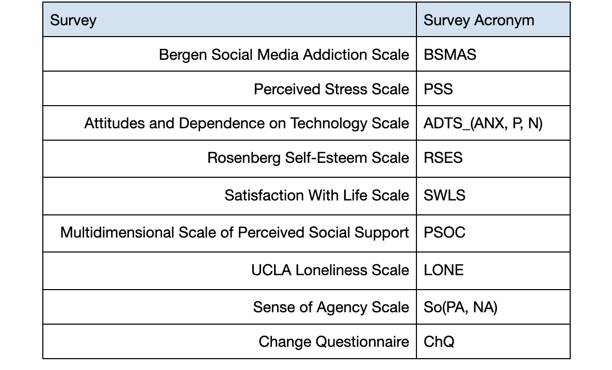
    <figcaption>Table 1. Psychological Surveys</figcaption>
</figure>

 

Note that the surveys administered for each semester changed over time so that not every student completed every survey. Table 2. quantifies which surveys were administered across each of the six semesters.

<figure>
    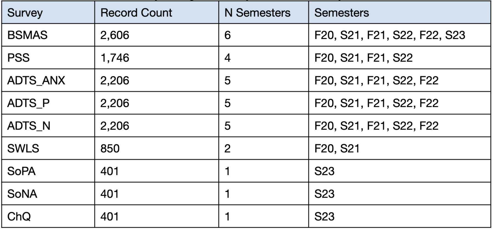
    <figcaption>Table 2. Psychological Surveys</figcaption>
</figure>

 

While each student ideally completed five rounds of surveys (an initial survey and four follow-up surveys), many completed fewer. The distribution of completed surveys can be seen below. Participants with fewer than the complete five surveys were either kept or removed from consideration depending on the analysis being conducted. 

<figure>
    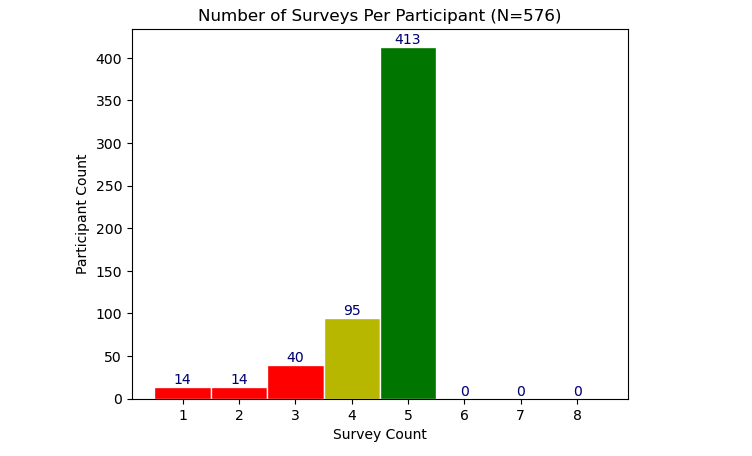
</figure>

#### Wellbeing and Social Media: Correlations

We start the investigation by asking what the relationship is between social media addiction (BSMAS) and the other surveys that relate to outcomes of wellbeing. We do this by looking at the pearson correlation ($$\rho$$) between the participant mean scores of the surveys and their BSMAS levels. Below is a table of correlations sorted by descending magnitude.

<figure>
    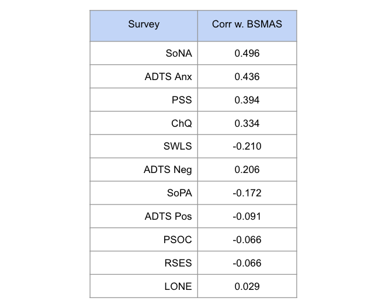
    <figcaption>Table 4. Mean BSMAS & Survey Correlations </figcaption>
</figure>

TODO: talk about the table

<figure>
    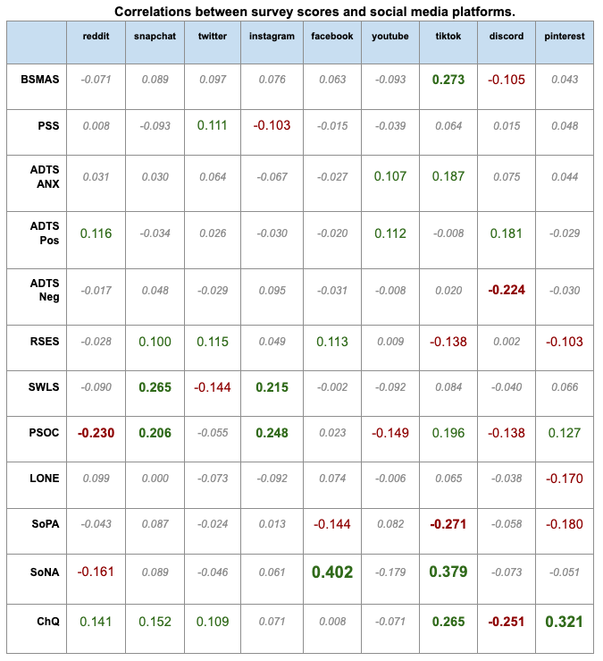
    <figcaption>Table 5. Survey Correlations with Social Media Platforms </figcaption>
</figure>

TODO: talk about the table

#### Does Social Media Addiction Make it Harder to Succeed?

<figure>
    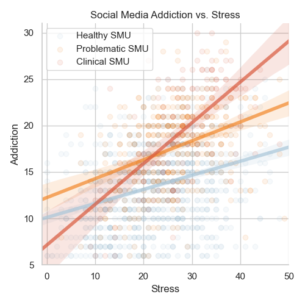
</figure>

TODO: talk about the plot

<figure>
    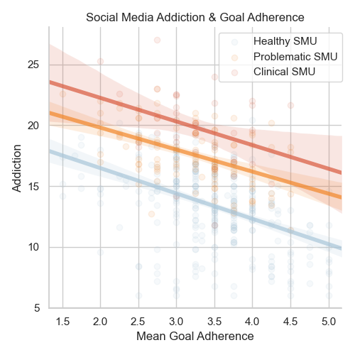
</figure>

TODO: talk about the plot

#### The Effect of the Intervention

<figure>
    
</figure>

<figure>
    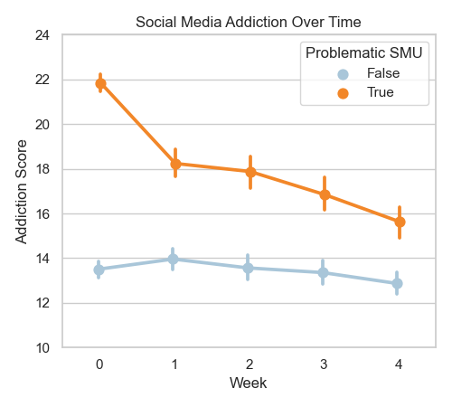
</figure>

<figure>
    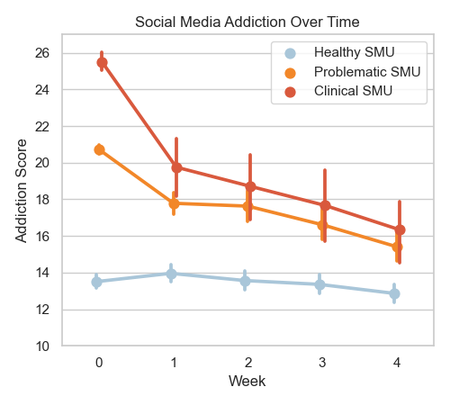
</figure>

#### Gender Differences? 

<figure>
    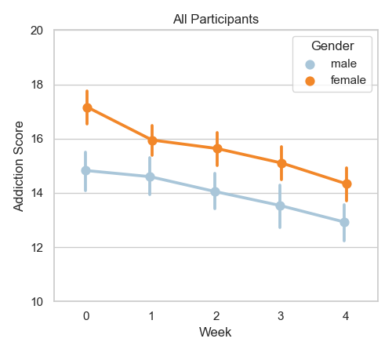
</figure>

<figure>
    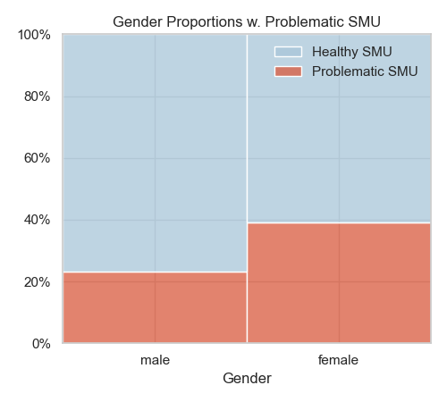
</figure>

<figure>
    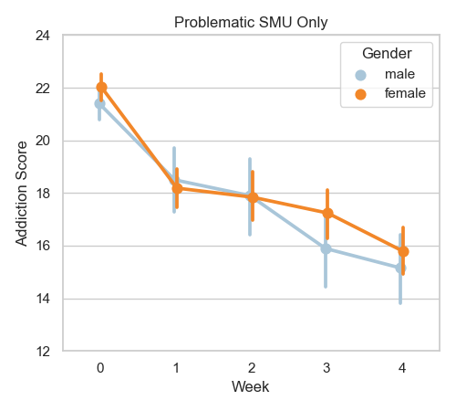
</figure>

#### Current and Future Directions



### References
[1] Kross, E., Verduyn, P., Sheppes, G., Costello, C. K., Jonides, J., & Ybarra, O. (2021). Social Media and Well-Being: Pitfalls, Progress, and Next Steps. Trends in Cognitive Sciences, 25(1), 55–66. https://doi.org/10.1016/j.tics.2020.10.005

[2] Cohen, S., Kamarck, T., & Mermelstein, R. (1983). A Global Measure of Perceived Stress. Journal of Health and Social Behavior, 24(4), 385–396. 

[3] ANDREASSEN, C. S., TORSHEIM, T., BRUNBORG, G. S., & PALLESEN, S. (2012). Development of a Facebook Addiction Scale. Psychological Reports, 110(2), 501–517. https://doi.org/10.2466/02.09.18.PR0.110.2.501-517

[4] Rosen LD, Whaling K, Carrier LM, Cheever NA, Rokkum J. The Media and Technology Usage and Attitudes Scale: An empirical investigation. Comput Human Behav. 2013 Nov 1;29(6):2501-2511. doi: 10.1016/j.chb.2013.06.006. PMID: 25722534; PMCID: PMC4338964.
