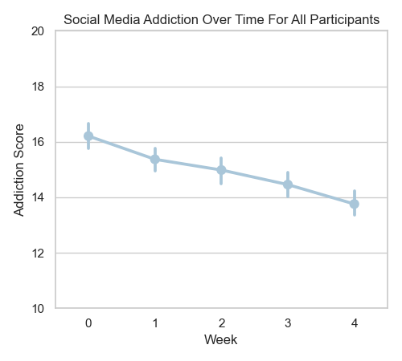

<head>
  <link rel="stylesheet" href="../assets/css/projectstyles.css">
</head>

# Social Media Challenge:  Data Analysis

#### Introduction

In this analysis, we take first steps towards insight into how social media behaviors differentially relate to outcomes of well-being by analyzing a novel data set collected from 576 college students who participated in a four-week, self-directed social media challenge. It contains free response data about social media behaviors, self-directed goals for change, a number of survey items related to well-being, and weekly self-reported success scores. With this rich dataset, we are uniquely positioned to better understand how outcomes of well-being may relate to different patterns of social media use, how some forms of goal-setting may be more effective than others for improving social media behavior, and whether a simple reduction of time spent on social media is a realistic goal in the social fabric of the modern world, which is increasingly facilitated by online interactions. 

#### Project Scope

This project primarily focuses on the <b><i>initial data anlysis</i></b> performed on the social media challenge dataset. We focus primarily on relationships between variables and patterns of success as it relates to reducing social media addiction scores as measured by the Bergen Social Media Addiction Scale (BSMAS). Note that further steps were taken with this data and those details can be found elsewhere, specifically in the [PRISM](prism) and [SMC Annotations](smc-annotations) projects. 

### <a href="https://github.com/nchp89/social_media_challenge_public/tree/main"><u>Check out the github repo for this project here!</u></a>

#### Impact

This project contributed to the founding of the non-profit [Post-Internet Project](https://www.postinternetproject.org) and its upcoming product, [PRISM](https://www.postinternetproject.org/prism). 

This analysis also resulted in a publication in [The Conversation]("https://theconversation.com/it-is-hijacking-my-brain-a-team-of-experts-found-ways-to-help-young-people-addicted-to-social-media-to-cut-the-craving-219954" ), a research-based news publisher.


#### Data

Our data was collected from six semesters of college students who participated in a social media cleanse challenge (n=2607, N=576). All data was de-identified prior to any analysis. At the start of the challenge, each student was asked to reflect on their personal relationship with social media, determine appropriate goals to improve their social media behavior, and then commit to a four-week self-directed effort in intentional behavior change. Students would check in once a week to complete a set of surveys related to their well-being and stress, report their success in sticking to their goals, and write a reflection on the previous week. A full table of included surveys can be found below in Table 1. 

<figure>
    
    <figcaption>Table 1. Psychological Surveys</figcaption>
</figure>

 

Note that the surveys administered for each semester changed over time so that not every student completed every survey. Table 2. quantifies which surveys were administered across each of the six semesters.

<figure>
    
    <figcaption>Table 2. Psychological Surveys</figcaption>
</figure>

 

While each student ideally completed five rounds of surveys (an initial survey and four follow-up surveys), many completed fewer. The distribution of completed surveys can be seen below. Participants with fewer than the complete five surveys were either kept or removed from consideration depending on the analysis being conducted. 

<figure>
    
</figure>

#### Wellbeing and Social Media

We start the investigation by asking the high-level question: what is the relationship between social media and wellbeing?

##### Wellbeing and Social Media Addiction

To start, we investigate the relationship between addiction (BSMAS) and the other surveys that relate to outcomes of wellbeing. We do this by looking at the pearson correlation ($$\rho$$) between the participant mean scores of the surveys and their BSMAS levels. Below is a table of correlations sorted by descending magnitude.

<figure>
    
    <figcaption>Table 4. Mean BSMAS & Survey Correlations </figcaption>
</figure>

From this table, we can group correlations into three categories: moderate-strong ($$\rho \gt 0.3$$), moderate-weak ($$0.3 \gt \rho \gt 0.5$$), and weak ($$\rho \lt 0.15$$). The weak correlations indicate no clear linear relationship between mean BSMAS and the mean survey score, and so I will not discuss them further.

###### Moderate-Strong Correlations
- <b><u>SoNA</u></b>: Sense of Negative Agency 
    - ($$\rho=0.496$$)
    - The strong correlation with social media addiction is sense of negative agency, and this makes sense to intuition! Addiction undermines choice and agency by coopting the reward circuitry in the brain. Addicts report feeling as if they are not in control of their actions, and it appears that that pattern holds strongly for social media addicts as well.
- <b><u>ADTS Anx</u></b>: Anxious Attitudes Towards Technology
    - ($$\rho=0.436$$)
    - Anxious attitudes towards tech also has a strong correlation with addiction. This indicates that those addicted to social media may be experiencing more anxiety as a result, or use social media as relief from anxiety, or some combination of the two.
- <b><u>PSS</u></b>: Perceived Stress
    - ($$\rho=0.394$$)
    - Perceived stress likely shares a similar story with anxious attitudes in its relationship with social media addiction. Those with a heightened sense of stress may seek respite in social media, or they may experience more stress as a result of their addiction to social media, or some combination of both.
- <b><u>ChQ</u></b>: Change Questionnaire 
    - ($$\rho=0.334$$)
    - Finally, we see a moderate-strong correlation between desire and motivation to change and social media addiction. This could suggest that those with social media addiction issues may themselves sense that something is "off" and consequently desire to change. Alternatively, time spent on social media could be making them feel unsatisfied with their lives, thus motivating change.

###### Moderate-Weak Correlations
- <b><u>SWLS</u></b>: Life Satisfaction
    - ($$\rho=-0.210$$)
    - Negatively correlated with social media addiction is life satisfaction. Perhaps low life satisfaction can lead to social media addiction or vice versa.
- <b><u>ADTS Neg</u></b>: Negative Attitudes Towards Technology
    - ($$\rho=0.206$$)
    - The correlation between negative attitudes towards technology and social media addiction suggests that those who have a low opinion of technology may also be at higher risk of addiction to it. 
- <b><u>SoPA</u></b>: Sense of Positive Agency
    - ($$\rho=-0.172$$)
    - Finally, we see a negative correlation between social media addiction and a sense of positive agency. This is expected, because as was described above, addiction and agency typically do not coincide.

##### Wellbeing and Social Media Platform

What about the relationship between wellbeing and the specific social media platforms? Are some better or worse than others? To get at this question, we correlate survey scores with social media platform indicator variables.

<figure>
    
    <figcaption>Table 5. Survey Correlations with Social Media Platforms </figcaption>
</figure>

There are too many correlations to discuss meaningfully here, so I will make just a few observations of what I believe to represent a larger pattern. 

1. <b>There are clear differences between platforms with respect to wellbeing.</b>
    - Take Reddit and TikTok. TikTok has the highest correlation with social media addiction compared to any other platform. Its associated with higher anxiety towards technology, lower self-esteem, lower sense of positive agency, and a higher sense of negative agency. 
2. <b>There are tradeoffs in terms of wellbeing and social media platform choice.</b>
    - If we resume our comparison from above, for all of its merits, Reddit is also associated with low perceptions of social support whereas TikTok is associated with higher levels of social support.
3.  <b>Social connection is highly varied across platforms.</b>
    - Despite its name, <i>social</i> media doesn't appear to be consistenty social. Some platforms may be better at fostering social connection than others (see PSOC correlations). Or, certain platforms may attract people who have fewer social ties.

As mentioned before, there's a lot more to get into here. Why is Facebook so strongly correlated with a sense of negative agency while instagram isn't? Why are pinterest users so interested in change, while discord users are not? How often is there an overlap of useage between social media platforms? Which ones co-occur and which ones are usually mutually exclusive? 

 

#### Social Media Addiciton and Stress

Among the moderate-strong correlations above, we take particular interest in the positive association between stress and social media addiction. A common report among people who feel that they spend too much time on social media is that they use it as a way to unwind. However, at first glance, it seems that a high level of social media use is associated with <i>more</i> stress, not less. 

We gain further insight into this relationship by subdividing our participant pool into 3 categories based on their initial social media addiction scores at the start of the challenge. Note that cutoffs were determined sources [5] and [6].

1. Healthy social media usage $$(BSMAS \lt 19)$$
2. Problematic social media usage $$(19 \leq BSMAS \lt 25)$$
3. Clinical social media usage $$(BSMAS \geq 25)$$

<figure>
    
</figure>

From this plot we see that stress increases along with social media addiction across each group of participants: Healthy, Problematic, and Clinical SMU. 

For Healthy SMU participants, even when stress is high the best-fit addiction score does not exceed the Problematic SMU threshold of 19. Problematic SMU participants show a similar slope to Healthy SMU participants, but a higher intercept, meaning that as stress rises to high levels, addiction scores rise into problematic levels. This pattern is unsurprising. Since we grouped participants based on initial social media addiction scores, we would expect a higher intercept for those with a higher initial score. 

Of more interest is the slope of the line relating stress to social media addiction. For those participants with an initial Clinical SMU score, we see a much steeper slope between stress and addiction. This could suggest multiple things. Perhaps those with Clinical SMU scores are much more sensitive to stress on average compared to their peers. Perhaps their addiction to social media is responsible for this accute sensitivity to stress. Or, maybe those with an accute sensitivity to stress are more likely to develop an addiction to social media. It may be that they turn to social media as a coping mechanism for stress in their life (a known phenomenon) and sink into an unhealthy relationship with it. Whatever the specific reason, it appears that sress and social media addiction exacerbate each other.

#### Social Media Addiction and Goal Adherence

A particular question of interest is whether social media addiction makes it more difficult to adhere to one's goals set for the duration of the social media challenge. Are those with Clinical SMU less likely to adhere to their goals than those with Healthy SMU? For this, we repeat the same grouping above into Healthy, Problematic, and Clinical SMU participants based on their initial surveys. We then plot and fit a line between mean addiction and mean goal adherence.

<figure>
    
</figure>

We see that for each group a negative relationship between addiction scores and goal adherence. As addiction scores rise, goal adherence falls, and vice versa. More interestingly, we see no difference between any of the three groups in terms of slope. That is, regardless of initial social media addiction score, the same magnitude of relationship exists between goal adherence and addiction score. 

Of course, it could be that a lower addiction level makes it easier to adhere to goals. However, the fact that the strength of the relationship remains the same across each of the three groups suggests that goal adherence is the primary driver here. Adhering to one's personal goals for change reliably leads to lower levels of social media addiction. And this makes sense in the context of our other findings! Recall from above that social media addiction (BSMAS) was positively correlated with a sense of negative agency (SoNA) and negatively correlated with a sense of positive agency (SoPA). It stands to reason that adhering to one's personally determined goals increases a sense of positive agency and reduces a sense of negative agency. Feeling in control of one's actions leads to one feeling like an agent -- the exact opposite of what addiction feels like.

#### The Effect of the Intervention

The results so far have been promising, but now we ask the most crucial question: how effective is the social media challenge intervention as a whole?

<figure>
    
</figure>

We begin this analysis by plotting the social media addiction scores for all participants for each week of the social media challenge.
From this graph we see that participants reliably reduce their social media addiction scores by an average of about 2 points on the BSMAS. If we subdivide our participants into the Healthy, Problematic, and Clinical SMU groupings as we had done above, we see much richer picture of the effects of the social media challenge intervention across the four weeks. 

<figure>
    
</figure>

From this we can make the following observations:
1. The social media challenge results in average social media addiction scores in the Healthy SMU range at the conclusion of four weeks for all participants regardless of initial addiction scores.
2. Those in the Clinical SMU group experience the largest benefit from the social media challenge, showing a mean reduction in addiction scores of 9.17 points. 
3. Those in the Problematic SMU group experienced a large beneit as well, showing a mean reduction in addiction scores of 5.31 points. 
4. Those in the Healthy SMU group showed no significant change in score, which is expectecd.

While points 2, 3, and 4 are interesting, the most important finding here is captured entirely in point 1. The social media challenge effectively reduced social media addiction regardless of initial addiction level. The fact that the intervention was most effective fore those with the most severe levels of addiction is only further proof that this method works. The social media challenge intervention is an effective way to reduce social media addiction.

#### Gender Differences? 

So far, we have only grouped participants on their initial level of social media addiction. However, there is a known phenomenon in the social media literature that girls are more adversely affected by the perils of social media than boys. Is our intervention equally effective across the genders? 

(**Note**: Those who identified as neither male nor female were removed from analysis due to insufficient data)

<figure>
    
</figure>

We begin this analysis by plotting the weekly addiction scores of male participants versus female participants. We notice two things:

1. Female participants show an avearge reduction of about 3 points, while male participants show a reduction of about 2 points. 
2. Female participants show consistently higher levels of addiction throughout the social media challenge, even after completing it. 

What's going on here? Does the social media challenge intervention have differential effects across genders? To answer this questions, let's look more closely at our data.

<figure>
    
</figure>

For this analysis, we combine Problematic and Clinical SMU cutoffs under the same threshold $$(BSMAS \geq 19)$$ and refer to it just as Problematic SMU. Consistent with the literature, we find that there is a higher proportion of female participants with an an initial Problematic SMU (39%) than male participants (22%). Recall from above that the intervention has so significant effect on social media addiction levels for those participants with an initial Healthy SMU. What do the gender differences look like when we consider only those with an initial Problematic SMU?

<figure>
    
</figure>

After removing those with a Healthy SMU from analysis, we see that the gender differences disappear. There is no significant difference between males and females across any time point in the duration of social media challenge in terms of addiction level.

#### Conclusion

We've learned about the relationships between several measures of wellbeing and social media addiction and successfully mapped the results onto our understanding of human psychology and behavior. We learned that there are differential effects on wellbeing across social media platforms. We also learned that the relationship between stress and social media addiction is particularly accute for those with the highest levels of addiction. Further, we showed that regardless of initial social media addiction levels, one can reliably reduce their social media addiction levels by adhering to improvement goals. Most importantly, we showed that the social media challenge intervention reliably reduced social media addiciton levels into a healthy range for all groups of participants, regardless of gender or initial addiction levels.

#### Current and Future Directions

This project was done in collaboration with Dr. Annie Margaret at the University of Colorado Boulder. It contributed to the founding of the non-profit [Post-Internet Project](https://postinternetproject.org) and is being utilized in the development of an educational tool called [PRISM](https://postinternetproject.org/prism). Please reach out to me or the Post-Internet Project team to learn more!



### References
[1] Kross, E., Verduyn, P., Sheppes, G., Costello, C. K., Jonides, J., & Ybarra, O. (2021). Social Media and Well-Being: Pitfalls, Progress, and Next Steps. Trends in Cognitive Sciences, 25(1), 55–66. https://doi.org/10.1016/j.tics.2020.10.005

[2] Cohen, S., Kamarck, T., & Mermelstein, R. (1983). A Global Measure of Perceived Stress. Journal of Health and Social Behavior, 24(4), 385–396. 

[3] ANDREASSEN, C. S., TORSHEIM, T., BRUNBORG, G. S., & PALLESEN, S. (2012). Development of a Facebook Addiction Scale. Psychological Reports, 110(2), 501–517. https://doi.org/10.2466/02.09.18.PR0.110.2.501-517

[4] Rosen LD, Whaling K, Carrier LM, Cheever NA, Rokkum J. The Media and Technology Usage and Attitudes Scale: An empirical investigation. Comput Human Behav. 2013 Nov 1;29(6):2501-2511. doi: 10.1016/j.chb.2013.06.006. PMID: 25722534; PMCID: PMC4338964.

[5] Luo, T., Qin, L., Cheng, L., Wang, S., Zhu, Z., Xu, J., Chen, H., Liu, Q., Hu, M., Tong, J., Hao, W., & Liao, Y. (2021). Determination the cut-off point for the Bergen social media addiction (BSMAS): Diagnostic contribution of the six criteria of the components model of addiction for social media disorder. Journal of Behavioral Addictions, 10(2), 281–290. https://doi.org/10.1556/2006.2021.00025

[6] Bányai, F., Zsila, Á., Király, O., Maraz, A., Elekes, Z., Griffiths, M. D., & Demetrovics, Z. (2017). Problematic social media use: Results from a large-scale nationally representative adolescent sample. PLoS ONE, 12(1), e0169839. https://doi.org/10.1371/journal.pone.0169839