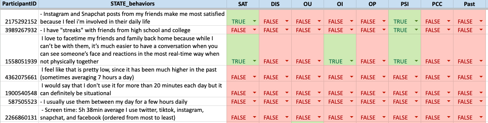
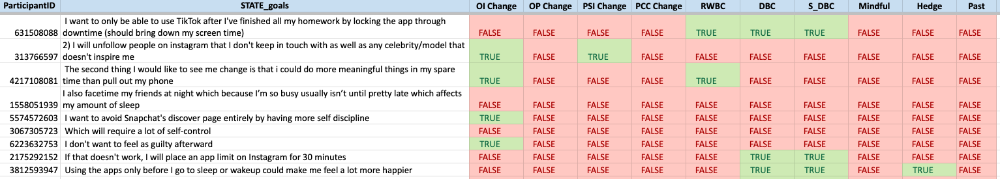
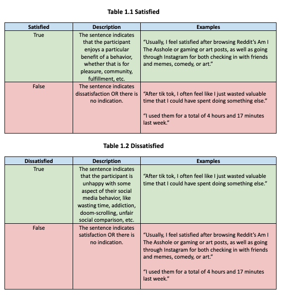
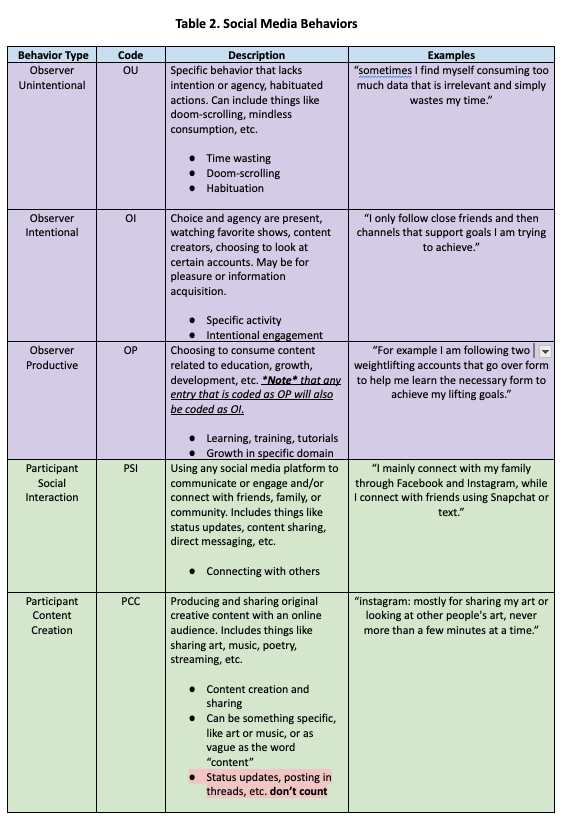
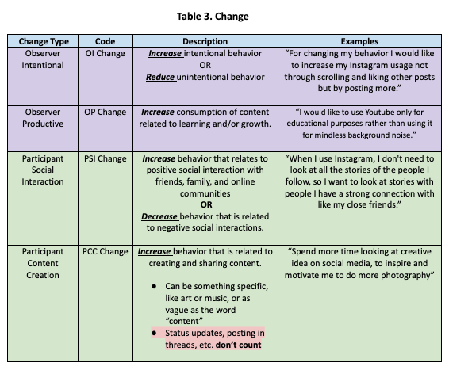
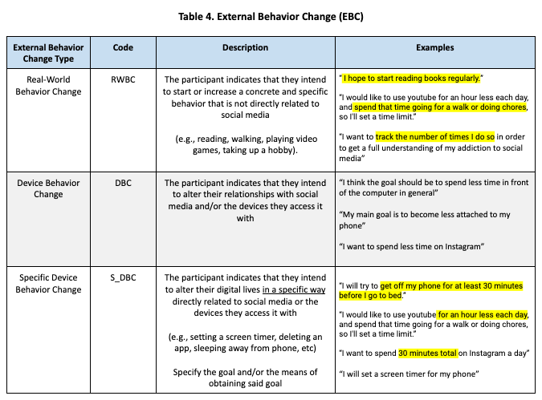
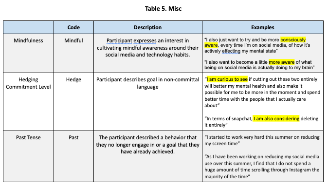
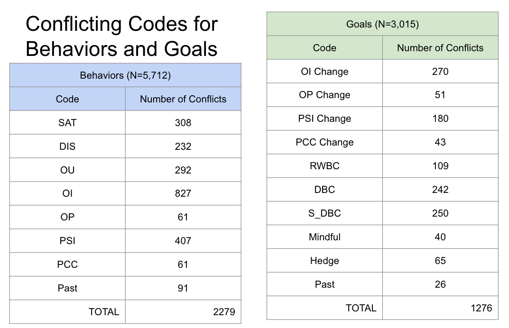
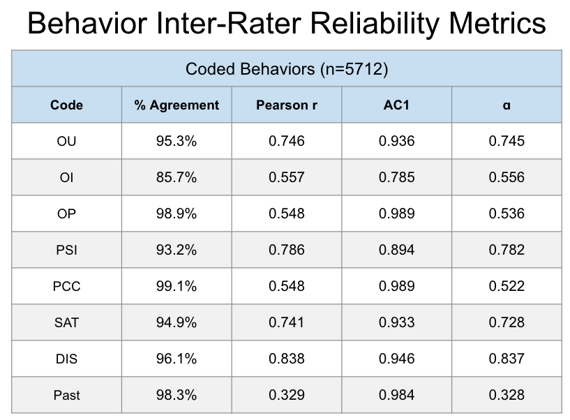
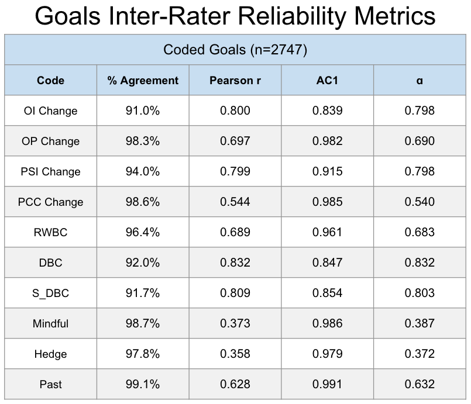

<head>
  <link rel="stylesheet" href="../assets/css/projectstyles.css">
</head>

# Social Media Challenge: Behavior & Goal Annotations

#### Project Overview & Motivation

In my collaboration with Dr. Annie Margaret at the University of Colorado Boulder, we investigated the effects of social media usage on wellbeing. This work was primarily conducted by way of analysis described in the [Social Media Challenge: Data Analysis Project](smc-analysis). The dataset used in that analysis is the same used here. However, rather than focusing on outcomes of wellbeing as they relate to social media addiction, we instead turn to the language used by participants to describe their social media behaviors and goals for change. 

Specifically, we developed an annotation system to code each sentence given by participants as to whether it indicated some specific aspect of behavior and goal-setting that were of interest for our work. Developing an annotation system for this data could be used for several purposes, including:
1. Analyzing specific linguistic features that may indicate a healthy/unhealthy social media behavior.
2. Understanding what sort of behavior & goal combination lead to the best wellbeing outcomes.
3. Developing machine learning models to automatically classify speech into informative and actionable categories.

#### Data

We start by generating two datasets from our original social media challenge data. Each dataset was created by splitting a freeform text entry into individual sentences. Since many entries were not formal English (e.g., bulleted lists), we segmented entries based on several criteria, including: periods, question marks, newline breaks, etc. Consequently, sentences were highly variable, ranging from grammatically correct English sentences to single-word sentence fragments. 

##### Social Media Behaviors (n=5,712)

The Social Media Behaviors dataset came from the following prompt:

> Describe your social media behaviors, and be specific. Which platforms do you use? For how long? How do you connect with friends/family virtually? Which behaviors leave you feeling connected/satisfied? Which leave you feeling empty or frustrated with wasted time? You may want to consult "screentime" on your phone to see which apps you've used an for how long, you might be surprised. 

##### Behavior Change Goals (n=2,747)

The Behavior Change Goals dataset came from the following prompt:

> How would you like to see your social media behaviors change? Be specific when listing your goals and intentions. For example "I would like use Instagram for 20 mins per day or less and I will set a limit on my phone to achieve this goal." Describe AT LEAST 3 concrete goals and intentions. 

#### Code Book

We developed the following codebook to capture constructs related to wellbeing and social media use. We group these codes into five categories for conceptual coherence. Note that tables 1.1, 1.2, and 2 are meant to capture behavior, while tables 3, 4, and 5 are meant to capture goals. Also note that the <i>Past</i> code was used for both behavior and change annotations.

##### Behavior Codes

##### Change Codes

#### Annotation Process

The annotation process was performed as follows: two trained annotators separately read each sentence and entered the relevant codes for both the behavior and goal datasets. The annotators were given the following guidelines to keep in mind while annotating the data:

1. Don’t infer
- Only code what the sentence itself tells you. 
- Do not reference adjacent sentences for more information.
2. Ignore tense
- Code for behaviors and goals regardless of whether the participant stated they no longer behave the way they state or if they have already completed the goal
- Tense is captured in its own code
3. When in doubt, bias towards False
- The sentence should state something specific that fits into one of our codes. 
- If you can’t point out the specific words that make that sentence fit with a code, then you should not enter True for that code. 
4. These codes are NOT mutually exclusive
- One sentence can be coded as True for all codes! 
5. You can ask questions
- While you cannot collaborate with your fellow coders during the sample coding process, you may email me for clarification questions about the coding scheme. 
- However, I cannot tell you what a sentence should be coded as.

The two annotators started with a subset of data equal to 10% of the total dataset. Following this initial step, small adjustments were made to the coding scheme for the sake of clarity before continuing on to the rest of the data.

Upon completing the codes for both datasets, inter-rater reliability metrics were taken to validate the annotation system. Codes that had sufficiently high metrics were kept and then passed to a third party -- a subject matter expert -- for adjudication. This final action resolved all conflicted codes and left us with a completed set of codes for each dataset.

#### Validation

We start the analysis of the validity of our annotation system by investigating the conflicts between our two annotators and then computing several metrics of inter-rater reliability -- metrics meant to quantify the reliability of a coding scheme across separate annotators.

We start by checking the number of conflicts occurred between annotators for each code. Note that each sentence could have multiple conflicts, as the codes were not mutually exclusive. Consider the behaviors dataset, which is composed of 5,712 sentences each with 8 codes. That makes for 5,712 x 8 = 45,696 codes. We see that some codes had more disagreement than others, specifically Observer Intentional (OI) in the behavor codes. More informative are the IRR metrics below.

##### Inter-Rater Reliability Metrics

The metrics below from left to right are the following:
1. % Agreement
-  The percentage of annotations where codes matched for both annotators.
2. Pearson $$\rho$$
- Pearson correlation between code entries (1=True, 0=False) between annotators.
3. Gwet's AC1
- IRR metric that is particularly good at handling imbalanced classes.
4. Krippendorf's $$\alpha$$
- IRR metric that is more stable for classes without imbalance.

For our purposes, we focus on Gwet's AC1 metric, as our classes were imbalanced. We went by the following rule-of-thumb cutoff for the AC1 metric:

Quality | AC1 Score Range  | 
:-----: | :--------------: | 
Unusable | $$0.0-0.5$$ | 
Poor | $$0.5-0.7$$ | 
Fair | $$0.7-0.8$$ | 
Good | $$0.8-0.9$$ | 
Geat | $$0.9-1.0$$ | 

 

Based on our scores and AC1 cutoffs, we see that all of our behavior codes are usable! OI was the lowest performing code, a score 0.785 that falls into the Fair category. The next lowest performing code was PSI, which was at the upper end of the Good category, and the rest of the behavior codes are considered great by the AC1 metric.

For our goal codes, we see that all but three fall into the Great category: OI Change, DBC, and S_DBC, with each of these considered to be good. 

In summary, according to the IRR metrics, we have validated the coding scheme presented above. 

#### Future Work

What has been described here is the crucial first step towards understanding and leveraging language about social media and behavior change towards better outcomes of wellbeing for young people. With this we can analyze what sort of linguistic features that relate to higher and lower scores on wellbeing outcome metrics, positive and negative social media behaviors, and better and worse strategies for successful change.

### NOTE

Work has paused on this project due to financial constraints with intent to resume in the summer of 2024